<div align="center">

# Отчет

</div>

<div align="center">

## Практическая работа №7

</div>

<div align="center">

## Локализация и списки. Формы ввода и валидация данных

</div>

**Выполнил:**  
Юрьев Глеб Евгеньевич 
**Курс:** 2  
**Группа:** ИНС-б-о-24-1

**Проверил:**   
Потапов И.Р. 

---

### Цель работы

Изучить механизмы локализации Android-приложений, научиться работать со списками (ListView, Spinner), освоить различные типы полей ввода и реализовать валидацию пользовательского ввода с использованием регулярных выражений.

### Ход работы
1. Создадим новый проект LocalizationAndFormsLab.
В файле strings.xml определим строку app_name и строку list_title ("Мой список").
Создадим локализованные ресурсы для английского языка (res/values-en/strings.xml).
Добавим на главный экран TextView, который отображает строку @string/list_title.

<div align="center">

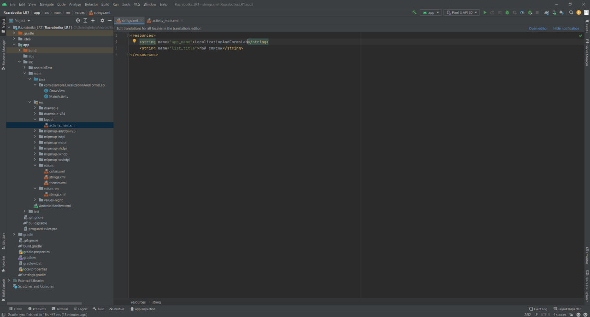

</div>

<div align="center">

*Рисунок 1. Определение строки app_name и строки list_title в файле strings.xml*

</div> 

<div align="center">

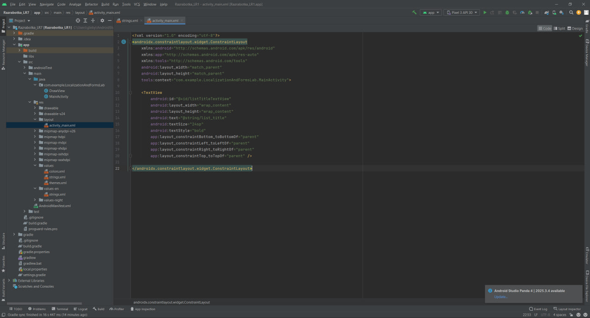

</div>

<div align="center">

*Рисунок 2. Добавление на главный экран TextView*

</div> 

2. В strings.xml создадим массив строк с одногруппниками (1 вариант индивидуального задания).
В разметке activity_main.xml добавим ListView.
В MainActivity.java получим массив из ресурсов, создадим ArrayAdapter и применим его к ListView.
Добавим обработчик setOnItClickListener, который будет показывать Toast с выбранным элементом.

<div align="center">

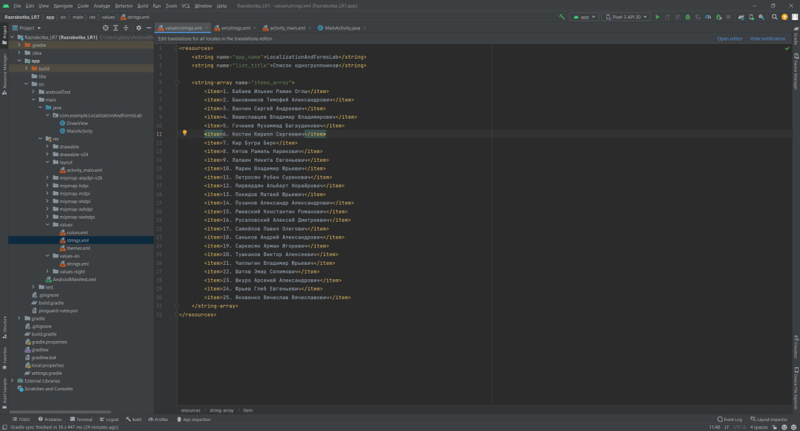

</div>

<div align="center">

*Рисунок 3. Файл strings.xml с информацией об одногруппниках*

</div> 

<div align="center">

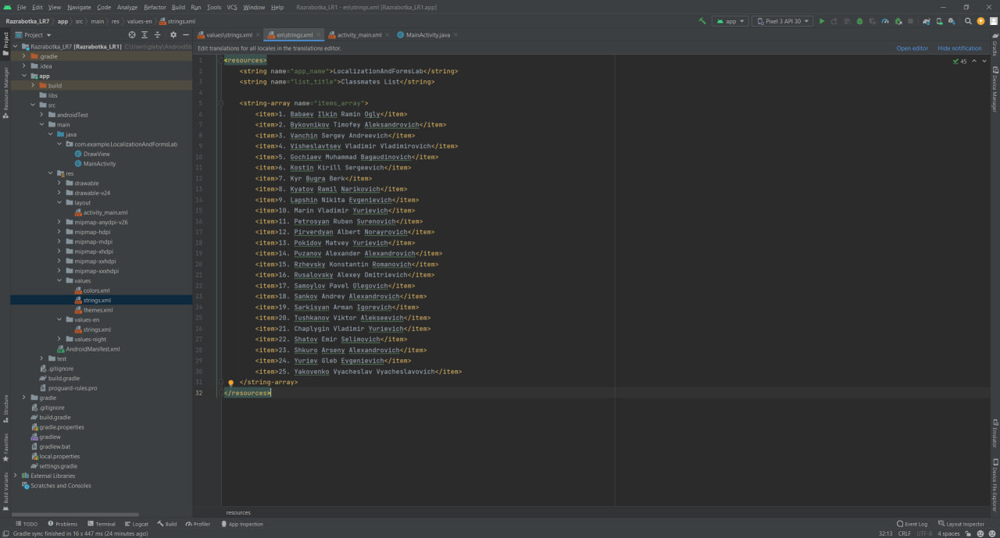

</div>

<div align="center">

*Рисунок 4. Файл en\strings.xml с информацией об одногруппниках на английском*

</div> 

<div align="center">

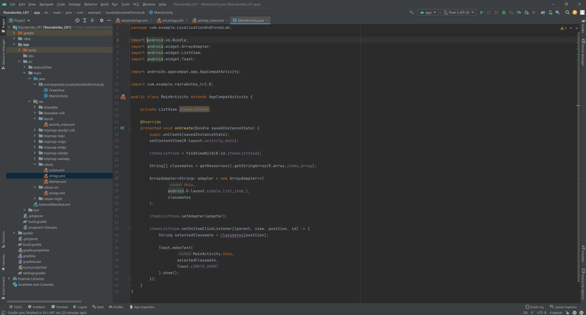

</div>

<div align="center">

*Рисунок 5. создадим ArrayAdapter в файле MainActivity и применим его к ListView, а также добавление обработчика setOnItClickListener*

</div> 

<div align="center">

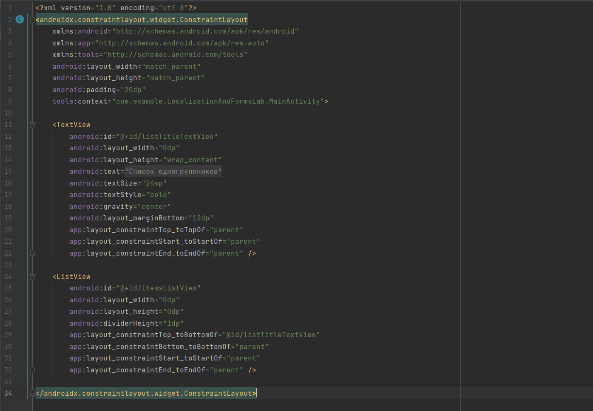

</div>

<div align="center">

*Рисунок 7. Добавление ListView в разметку activity_main.xml*

</div>

<div align="center">

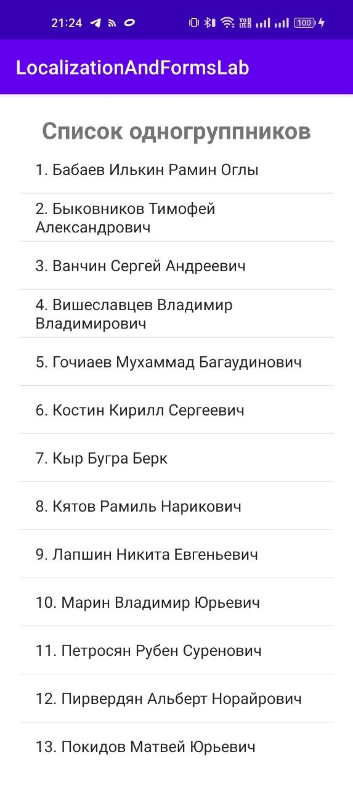

</div>

<div align="center">

*Рисунок 8. Результат в приложении*

</div>

<div align="center">

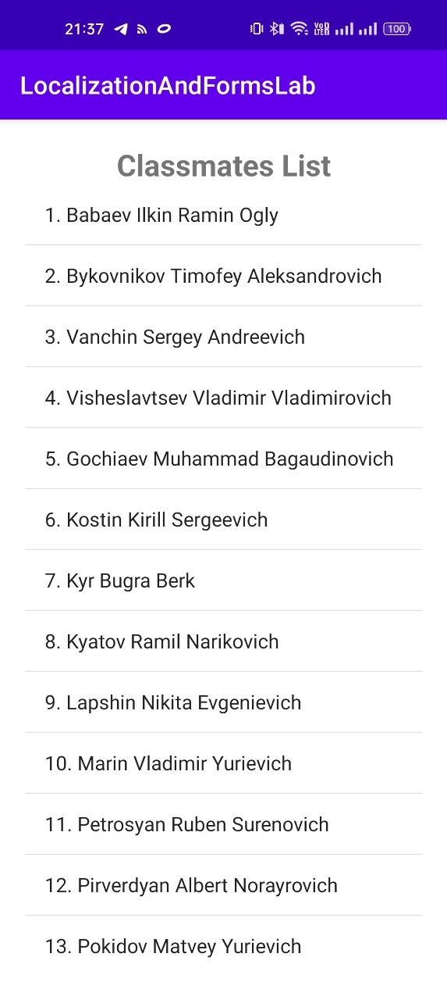

</div>

<div align="center">

*Рисунок 9. Результат в приложении на английском языке*

</div>

3.  Создадим новую Activity (RegistrationActivity) и соответствующую разметку activity_registration.xml.
Добавим на форму следующие поля (использя TextInputLayout из библиотеки Material Design для красоты или обычные EditText):
- ФИО (EditText)
- Логин (EditText)
- Email (EditText)
- Номер телефона (EditText)
- Пароль (EditText, inputType="textPassword")
- Повтор пароля (EditText, inputType="textPassword")
- Дата рождения (EditText + кнопка для вызова DatePickerDialog)
- Spinner для выбора из списка согласно варианту
- CheckBox "Согласие на обработку персональных данных"
 -Кнопка "Зарегистрироваться"
После, реализуем валидацию всех полей.

<div align="center">

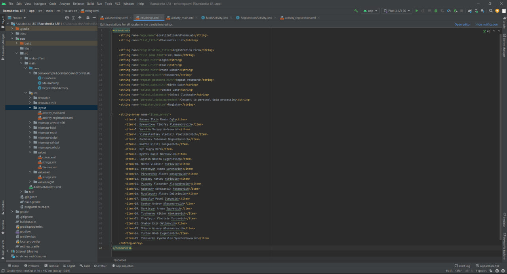

</div>

<div align="center">

*Рисунок 10. Добавление формы в файле en\strings.xml*

</div>

<div align="center">

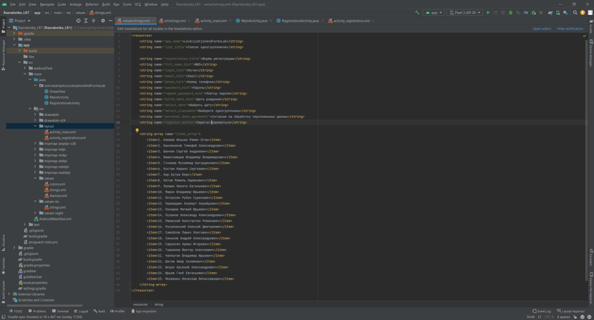

</div>

<div align="center">

*Рисунок 11. Добавление формы в файле strings.xml*

</div>

Код RegistrationActivity.java:

```java
package com.example.LocalizationAndFormsLab;

import android.app.DatePickerDialog;
import android.os.Bundle;
import android.util.Log;
import android.widget.ArrayAdapter;
import android.widget.Button;
import android.widget.CheckBox;
import android.widget.EditText;
import android.widget.Spinner;
import android.widget.Toast;

import androidx.appcompat.app.AppCompatActivity;

import com.example.razrabotka_lr1.R;

import java.util.Calendar;

public class RegistrationActivity extends AppCompatActivity {

    private static final String TAG = "Registration";

    private EditText fullNameEditText;
    private EditText loginEditText;
    private EditText emailEditText;
    private EditText phoneEditText;
    private EditText passwordEditText;
    private EditText repeatPasswordEditText;
    private EditText birthDateEditText;

    private Spinner classmateSpinner;
    private CheckBox agreementCheckBox;
    private Button selectDateButton;
    private Button registerButton;

    @Override
    protected void onCreate(Bundle savedInstanceState) {
        super.onCreate(savedInstanceState);
        setContentView(R.layout.activity_registration);

        fullNameEditText = findViewById(R.id.fullNameEditText);
        loginEditText = findViewById(R.id.loginEditText);
        emailEditText = findViewById(R.id.emailEditText);
        phoneEditText = findViewById(R.id.phoneEditText);
        passwordEditText = findViewById(R.id.passwordEditText);
        repeatPasswordEditText = findViewById(R.id.repeatPasswordEditText);
        birthDateEditText = findViewById(R.id.birthDateEditText);

        classmateSpinner = findViewById(R.id.classmateSpinner);
        agreementCheckBox = findViewById(R.id.agreementCheckBox);
        selectDateButton = findViewById(R.id.selectDateButton);
        registerButton = findViewById(R.id.registerButton);

        ArrayAdapter<CharSequence> spinnerAdapter = ArrayAdapter.createFromResource(
                this,
                R.array.items_array,
                android.R.layout.simple_spinner_item
        );

        spinnerAdapter.setDropDownViewResource(android.R.layout.simple_spinner_dropdown_item);
        classmateSpinner.setAdapter(spinnerAdapter);

        selectDateButton.setOnClickListener(view -> showDatePicker());
        birthDateEditText.setOnClickListener(view -> showDatePicker());

        registerButton.setOnClickListener(view -> validateForm());
    }

    private void showDatePicker() {
        Calendar calendar = Calendar.getInstance();

        int year = calendar.get(Calendar.YEAR);
        int month = calendar.get(Calendar.MONTH);
        int day = calendar.get(Calendar.DAY_OF_MONTH);

        DatePickerDialog datePickerDialog = new DatePickerDialog(
                this,
                (view, selectedYear, selectedMonth, selectedDay) -> {
                    String dayText;
                    String monthText;

                    if (selectedDay < 10) {
                        dayText = "0" + selectedDay;
                    } else {
                        dayText = String.valueOf(selectedDay);
                    }

                    if (selectedMonth + 1 < 10) {
                        monthText = "0" + (selectedMonth + 1);
                    } else {
                        monthText = String.valueOf(selectedMonth + 1);
                    }

                    String date = dayText + "." + monthText + "." + selectedYear;
                    birthDateEditText.setText(date);
                },
                year,
                month,
                day
        );

        datePickerDialog.show();
    }

    private void validateForm() {
        String fullName = fullNameEditText.getText().toString().trim();
        String login = loginEditText.getText().toString().trim();
        String email = emailEditText.getText().toString().trim();
        String phone = phoneEditText.getText().toString().trim();
        String password = passwordEditText.getText().toString();
        String repeatPassword = repeatPasswordEditText.getText().toString();
        String birthDate = birthDateEditText.getText().toString().trim();
        boolean isAgreed = agreementCheckBox.isChecked();

        boolean isValid = true;

        if (!fullName.matches("^[А-Яа-яЁё\\s-]+$")) {
            fullNameEditText.setError("Только русские буквы, пробелы и дефис");
            Log.w(TAG, "Неверный формат ФИО: " + fullName);
            isValid = false;
        }

        if (!login.matches("^[A-Za-z]+$")) {
            loginEditText.setError("Только латинские буквы");
            Log.w(TAG, "Неверный формат логина: " + login);
            isValid = false;
        }

        if (!email.matches("^[A-Za-z0-9._%+-]+@[A-Za-z0-9.-]+\\.[A-Za-z]{2,}$")) {
            emailEditText.setError("Неверный формат email");
            Log.w(TAG, "Неверный формат email: " + email);
            isValid = false;
        }

        if (!phone.matches("^\\+7\\d{10}$") &&
                !phone.matches("^\\+7\\s?\\(?\\d{3}\\)?\\s?\\d{3}-?\\d{2}-?\\d{2}$")) {
            phoneEditText.setError("Формат: +7XXXXXXXXXX или +7 (XXX) XXX-XX-XX");
            Log.w(TAG, "Неверный формат телефона: " + phone);
            isValid = false;
        }

        if (!password.matches("^(?=.*[A-Z])(?=.*\\d).{6,}$")) {
            passwordEditText.setError("Минимум 6 символов, одна цифра и одна заглавная буква");
            Log.w(TAG, "Неверный формат пароля");
            isValid = false;
        }

        if (!password.equals(repeatPassword)) {
            repeatPasswordEditText.setError("Пароли не совпадают");
            Log.w(TAG, "Пароли не совпадают");
            isValid = false;
        }

        if (!birthDate.matches("^(0[1-9]|[12][0-9]|3[01])\\.(0[1-9]|1[012])\\.(19|20)\\d{2}$")) {
            birthDateEditText.setError("Формат: ДД.ММ.ГГГГ");
            Log.w(TAG, "Неверный формат даты: " + birthDate);
            isValid = false;
        } else if (!isBirthDateCorrect(birthDate)) {
            birthDateEditText.setError("Дата должна быть не раньше 1900 года и не позже текущей даты");
            Log.w(TAG, "Дата рождения вне допустимого диапазона: " + birthDate);
            isValid = false;
        }

        if (!isAgreed) {
            agreementCheckBox.setError("Необходимо согласие");
            Log.w(TAG, "Согласие на обработку данных не отмечено");
            isValid = false;
        } else {
            agreementCheckBox.setError(null);
        }

        if (isValid) {
            String selectedClassmate = classmateSpinner.getSelectedItem().toString();

            Log.i(TAG, "Регистрация успешна");
            Log.i(TAG, "ФИО: " + fullName);
            Log.i(TAG, "Логин: " + login);
            Log.i(TAG, "Email: " + email);
            Log.i(TAG, "Телефон: " + phone);
            Log.i(TAG, "Дата рождения: " + birthDate);
            Log.i(TAG, "Выбранный одногруппник: " + selectedClassmate);

            Toast.makeText(
                    this,
                    "Регистрация успешна",
                    Toast.LENGTH_LONG
            ).show();
        } else {
            Toast.makeText(
                    this,
                    "Исправьте ошибки в форме",
                    Toast.LENGTH_LONG
            ).show();
        }
    }

    private boolean isBirthDateCorrect(String birthDate) {
        String[] parts = birthDate.split("\\.");

        int day = Integer.parseInt(parts[0]);
        int month = Integer.parseInt(parts[1]) - 1;
        int year = Integer.parseInt(parts[2]);

        Calendar selectedDate = Calendar.getInstance();
        selectedDate.setLenient(false);
        selectedDate.set(year, month, day);

        Calendar minDate = Calendar.getInstance();
        minDate.set(1900, Calendar.JANUARY, 1);

        Calendar currentDate = Calendar.getInstance();

        try {
            selectedDate.getTime();
        } catch (Exception e) {
            return false;
        }

        return !selectedDate.before(minDate) && !selectedDate.after(currentDate);
    }
}
```

Код activity_registration.xml:

```xml
<?xml version="1.0" encoding="utf-8"?>
<ScrollView
    xmlns:android="http://schemas.android.com/apk/res/android"
    android:layout_width="match_parent"
    android:layout_height="match_parent">

    <LinearLayout
        android:layout_width="match_parent"
        android:layout_height="wrap_content"
        android:orientation="vertical"
        android:padding="24dp">

        <TextView
            android:id="@+id/registrationTitleTextView"
            android:layout_width="match_parent"
            android:layout_height="wrap_content"
            android:text="@string/registration_title"
            android:textSize="26sp"
            android:textStyle="bold"
            android:gravity="center"
            android:layout_marginBottom="24dp" />

        <EditText
            android:id="@+id/fullNameEditText"
            android:layout_width="match_parent"
            android:layout_height="wrap_content"
            android:hint="@string/full_name_hint"
            android:inputType="textPersonName"
            android:layout_marginBottom="12dp" />

        <EditText
            android:id="@+id/loginEditText"
            android:layout_width="match_parent"
            android:layout_height="wrap_content"
            android:hint="@string/login_hint"
            android:inputType="text"
            android:layout_marginBottom="12dp" />

        <EditText
            android:id="@+id/emailEditText"
            android:layout_width="match_parent"
            android:layout_height="wrap_content"
            android:hint="@string/email_hint"
            android:inputType="textEmailAddress"
            android:layout_marginBottom="12dp" />

        <EditText
            android:id="@+id/phoneEditText"
            android:layout_width="match_parent"
            android:layout_height="wrap_content"
            android:hint="@string/phone_hint"
            android:inputType="phone"
            android:layout_marginBottom="12dp" />

        <EditText
            android:id="@+id/passwordEditText"
            android:layout_width="match_parent"
            android:layout_height="wrap_content"
            android:hint="@string/password_hint"
            android:inputType="textPassword"
            android:layout_marginBottom="12dp" />

        <EditText
            android:id="@+id/repeatPasswordEditText"
            android:layout_width="match_parent"
            android:layout_height="wrap_content"
            android:hint="@string/repeat_password_hint"
            android:inputType="textPassword"
            android:layout_marginBottom="12dp" />

        <LinearLayout
            android:layout_width="match_parent"
            android:layout_height="wrap_content"
            android:orientation="horizontal"
            android:layout_marginBottom="12dp">

            <EditText
                android:id="@+id/birthDateEditText"
                android:layout_width="0dp"
                android:layout_height="wrap_content"
                android:layout_weight="1"
                android:hint="@string/birth_date_hint"
                android:inputType="none"
                android:focusable="false"
                android:clickable="true" />

            <Button
                android:id="@+id/selectDateButton"
                android:layout_width="wrap_content"
                android:layout_height="wrap_content"
                android:text="@string/select_date" />

        </LinearLayout>

        <TextView
            android:id="@+id/selectClassmateTextView"
            android:layout_width="match_parent"
            android:layout_height="wrap_content"
            android:text="@string/select_classmate"
            android:textSize="16sp"
            android:layout_marginBottom="8dp" />

        <Spinner
            android:id="@+id/classmateSpinner"
            android:layout_width="match_parent"
            android:layout_height="wrap_content"
            android:layout_marginBottom="16dp" />

        <CheckBox
            android:id="@+id/agreementCheckBox"
            android:layout_width="match_parent"
            android:layout_height="wrap_content"
            android:text="@string/personal_data_agreement"
            android:layout_marginBottom="20dp" />

        <Button
            android:id="@+id/registerButton"
            android:layout_width="match_parent"
            android:layout_height="wrap_content"
            android:text="@string/register_button" />

    </LinearLayout>

</ScrollView>

```

<div align="center">

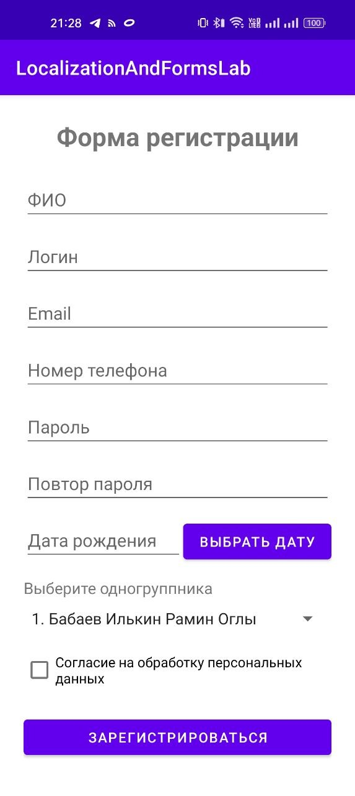

</div>

<div align="center">

*Рисунок 12. Результат формы при запуске приложения*

</div> 

### Вывод
В ходе практической работы были изучены механизмы локализации Android-приложений, работа со списками ListView и Spinner, а также создание формы ввода данных. Была реализована валидация пользовательского ввода с помощью регулярных выражений, вывод ошибок через setError() и сообщений в Logcat. Приложение корректно отображает данные на русском и английском языках.
### Ответы на контрольные вопросы
1.  **Вопрос 1: Как в Android реализуется локализация приложений? Опишите структуру папок для поддержки нескольких языков.** 
Локализация в Android реализуется через разные папки ресурсов: основные строки хранятся в res/values/strings.xml, а переводы — в папках вроде res/values-en/strings.xml, res/values-ru/strings.xml. При смене языка система автоматически выбирает нужные ресурсы.
2.  **Вопрос 2: Для чего используются адаптеры (например, ArrayAdapter) при работе со списками ListView и Spinner?**
Адаптеры нужны для связи данных со списками. ArrayAdapter берёт массив или список данных и передаёт его в ListView или Spinner, чтобы элементы отображались на экране.
3.  **Вопрос 3: Какие атрибуты EditText позволяют ограничить тип вводимых данных? Приведите примеры.**
Тип вводимых данных ограничивается атрибутом android:inputType. Например, textPersonName используется для имени, textEmailAddress для email, phone для телефона, textPassword для пароля, number для чисел.
4. **Вопрос 4: Что такое регулярные выражения? Как с их помощью проверить, что строка является валидным email-адресом?**
Регулярные выражения — это шаблоны для проверки строк. Email можно проверить, например, выражением ^[A-Za-z0-9._%+-]+@[A-Za-z0-9.-]+\\.[A-Za-z]{2,}$, используя метод matches().
5. **Вопрос 5: Как программно установить ошибку на поле ввода (EditText), чтобы она отображалась пользователю?** 
Ошибку на поле ввода можно установить методом setError(), например: editText.setError("Неверный ввод");. После этого поле будет подсвечено, а пользователь увидит сообщение об ошибке.
6. **Вопрос 6: В чём разница между CheckBox и RadioGroup? В каких случаях используется каждый из них?** 
CheckBox используется, когда можно выбрать один или несколько вариантов, например согласие на обработку данных. RadioGroup используется, когда нужно выбрать только один вариант из нескольких, например пол.
7. **Вопрос 7: Как вывести диалоговое окно для выбора даты (DatePickerDialog) и получить выбранное значение?** 
Для выбора даты используется DatePickerDialog. После выбора даты значения дня, месяца и года можно получить в обработчике и записать в EditText или TextView.
8. **Вопрос 8: Для чего используется метод String.matches()? Что он возвращает?** 
Метод String.matches() проверяет, соответствует ли строка заданному регулярному выражению. Он возвращает true, если строка подходит под шаблон, и false, если не подходит.